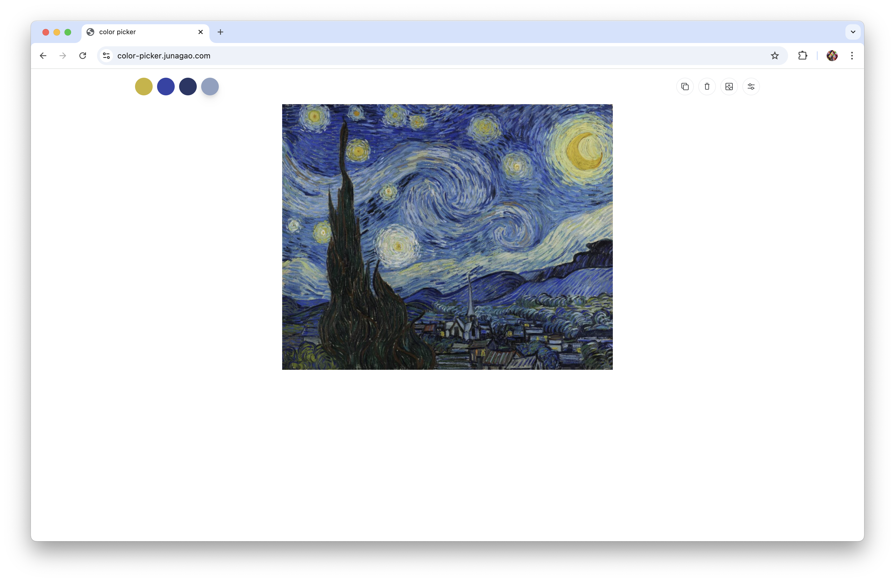

# color picker

A simple tool to select colors from an image and copy colors to clipboard (single or palette).

https://color-picker.junagao.com/

## Features

- select colors from a single or multiple images
- add local image or from url
- eyedropper with magnifier
- copy color code to clipboard
- copy color palette to clipboard
- remove color
- remove palette
- choose preferred format:
  - legacy css syntax: numbers + commas: `rgb(255, 0, 0)`
  - legacy css syntax: only numbers + commas: `255, 0, 0`
  - legacy css syntax: percentage + commas: `rgb(100%, 0%, 0%)`
  - legacy css syntax: only percentage + commas: `100%, 0%, 0%`
  - modern css syntax: numbers: `rgb(255 0 0)`
  - modern css syntax: only numbers: `255 0 0`
  - modern css syntax: percentage: `rgb(100% 0% 0%)`
  - modern css syntax: only percentage: `100% 0% 0%`
- choose palette color space
- supported color spaces: `hex`, `rgb`, `hsl`, `hwb`, `lab`, `oklab`, `lch`, `oklch`, `hsb`, `cmyk`
